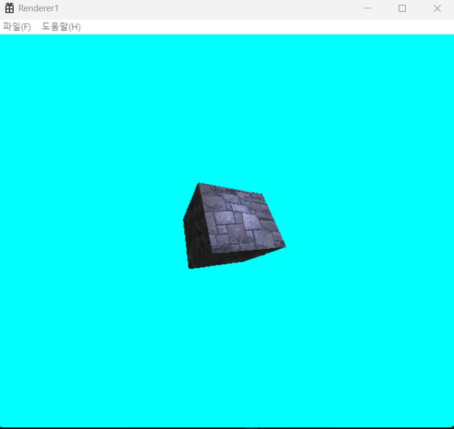

# SWRasterizer

렌더링 파이프라인을 C++로 구현한 프로젝트입니다.

직접 구현한 버텍스 셰이더, 래스터라이저, 프래그먼트 셰이더, 깊이 버퍼를 통해 텍스처가 적용된 큐브를 화면에 그립니다.

## 주요 기능

- Win32 데스크톱 애플리케이션 기반 렌더링
- CPU에서 직접 수행하는 3D 렌더링 파이프라인
- 월드, 뷰, 프로젝션 행렬 변환
- 삼각형 단위 래스터라이징
- 백페이스 컬링
- phong shading 조명 계산
- TGA 텍스처 로딩
- 컬러 버퍼 + 깊이 버퍼 기반 최종 합성
- 방향키를 이용한 실시간 큐브 회전

## 렌더링 파이프라인 구성

- `DataVertex`: 정점 데이터를 생성합니다. 현재는 직접 큐브 메시를 만들어 사용합니다.
- `VertexShader`: 월드 변환, 뷰 변환, 투영 변환을 수행합니다.  
- `Rasterizer`: 투영 후 원근 나눗셈을 수행하고, 백페이스 컬링을 적용한 뒤, 삼각형을 스캔 변환하여 프래그먼트 목록으로 확장합니다.
- `FragmentShader`: 텍스처를 사용해 앰비언트/디퓨즈/스페큘러 값을 계산하고 최종 픽셀 색을 만듭니다.
- `Merger`: 깊이 버퍼 비교를 거쳐 프레임 버퍼를 기록합니다.
- `BitmapDrawer`: 최종 컬러 버퍼를 Win32 윈도우에 출력합니다.
